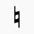
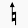
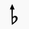
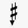
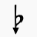
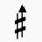
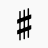
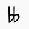
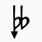

# 27, 34, 41 Edo Retuner Plugin for Musescore 2 / 3

Musescore plugin to automatically retune notes in following edos: 

27-edo, 
[34-edo](https://en.wikipedia.org/wiki/34_equal_temperament) (also 17-edo), 
[41-edo](https://en.wikipedia.org/wiki/41_equal_temperament), 
and (as a bonus) [19-edo](https://en.wikipedia.org/wiki/19_equal_temperament). 

**Important: what's different from the original**

1. D-centered tuning, for the least net offset; 
2. Fifth-based key signatures, since I reckon it more intuitive. 

If you prefer the original A-centered tuning and tone-based key signatures, you're free to fork it and do it yourself. 

## Usage

Download the QML files and put them in the plugins folder.

To retune the entire score as is, run the plugin located in Plugins > Notes > Retune 27/34/41-TET.

To only retune selected notes, make a selection before running the plugin.

--------

### Accidentals (27/34/41 edo)

#### Ups and Downs Notation

> Plugin file: \
> https://github.com/floracanou/musescore-n-tet-plugins/blob/master/41-TET.qml \
> https://github.com/floracanou/musescore-n-tet-plugins/blob/master/34-TET.qml \
> https://github.com/floracanou/musescore-n-tet-plugins/blob/master/27-TET.qml

All these edos follow a fairly simple logic: one sharp/flat represents 4 steps. 

| Edo | Steps between D-E-F-G-A-B-C-D |
| :----: | :----: |
| 27 | 5-1-5-5-5-1-5 |
| 34 | 6-2-6-6-6-2-6 |
| 41 | 7-3-7-7-7-3-7 |

These are the accidentals used by the plugin. 
They can be found in the [advanced palette](https://musescore.org/en/handbook/palettes-and-workspaces#workspaces).

| Steps | Accidental | Steps | Accidental |
| :----: | :----: | :----: | :----: |
| 0   |  |||
| -1  |  | +1  |  |
| -2  |  | +2  |  |
| -3  |  | +3  |  |
| -4  |  | +4  |  |
| -5  |  | +5  |  |
| -6  |  | +6  |  |
| -7  |  | +7  |  |
| -8  |  | +8  |  |
| -9  |  | +9  |  |

**Important**: I've commented out +-9 in 34-edo, and +-9 and +-7 in 27-edo
because they exceed the 300-cent limit of display, 
and you should probably never need them. 

### Accidentals (19 edo)

#### Meantone notation

> Plugin file: \
> https://github.com/euwbah/musescore-n-tet-plugins/blob/master/19-TET-Simple.qml

A very simple one. It doesn't even use custom accidentals. 

These are the accidentals used by the plugin.

| Steps | Accidental | Steps | Accidental |
| :----: | :----: | :----: | :----: |
| 0   |  |||
| -1  |  | +1  |  |
| -2  |  | +2  |  |

### Custom key signatures

As MuseScore doesn't completely support
[custom key signatures](https://musescore.org/en/handbook/key-signatures#custom-key-signatures),
any custom key signature can't be read by the plugin, at least for now.

Should you want to create a microtonal key signature and have it affect the
playback, you have to explicitly declare the custom key signature using
system/staff text containing accidental code:

Note that explicit accidentals will still take precedence over the
declared custom key signature, behaving exactly the same way a key signature would.

#### Accidental Code

| Accidental | Textual representation | Accidental | Textual representation |
| :----: | :----: | :----: | :----: |
|  | Leave blank / any other character  |
|    | `v` |  | `^` |
|    | `d` |  | `+` |
|    | `b^` |  | `#v` |
|    | `b`  |  | `#`  |
|  | `bv`  |  | `#^`  |
|  | `db` or `bd`  |  | `#+` or `+#`  |
|  | `bb^` |  | `xv`  |
|  | `bb` |  | `x`  |
|  | `bbv` |  | `x+`  |

You can indicate custom key signatures by entering the key signature using
System Text or Staff Text.

- Use **System Text** (`Ctrl` + `Shift` + `T`) if you want the key signature code to affect
  all staves from there onwards
- Use **Staff Text** (`Shift` + `T`) if you only want the code to affect the staff that it is on.
  This is especially useful when using custom **local** key signatures!
- Remember to make the custom key signature code invisible! (Press `V` to toggle visibility)

Key signature code syntax:

1. Start with a dot `.`
2. Put the textual representation of the accidental for the note **F** using the [accidental code](#accidental-code)
3. Put another dot `.`
4. Put the required accidental for **C**
5. Repeat from **F** thru **B** 

Note that There **must** be seven `.` in total,
natural accidentals are denoted by leaving the space blank, or using any other character
that does not represent an accidental.

Spaces/newlines can be placed before or after the dots to improve readability.

**For example:**
Ab-down major in ups-and-downs mode can be denoted like this: `.#v.#v.#v.v.v.v.v`
representing the key signature of F#v, C#v, G#v, D#v, Av, Ev, Bv.

For a meantone-ish sound, this: `.#v.#v.#v.v.d.d.d`
representing the key signature of F#v, C#v, G#v, D#v, Ad, Ed, Bd.

**Important:** Following a custom key signature, should there be a modulation to any standard
key signature, it is still necessary to reset the custom key signature to the default, that is,
`.......`. Otherwise, the previous custom key signature would still be in effect, as it is being
overridden. Regular and custom key signatures are not compatible with each other.

### Note to self / developers:

##### Definitions:

`tpc`
: Tonal pitch class

`segment.annotations[idx].textStyleType`
: 22 if Staff Text,
: 21 if System Text

`segment.annotations[idx].text`
: Contains given text

## TODO:

- Let's follow the upstream. 

## [Changelog](./CHANGELOG.md)

