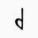
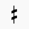
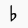
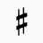
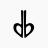
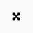
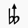
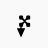

# N-Edo Retuner Plugin for Musescore 2 / 3

Musescore plugin to automatically retune notes in any edo based on traditional heptatonic scale. 

**The code is edo-agnostic!**
Just change the number in line 7: 
`property var n: 24`
to whatever edo you like and boom, you have it! 

For the accidentals used in each edo, see [Alternative Symbols for Ups and Downs Notation](https://en.xen.wiki/w/Alternative_Symbols_for_Ups_and_Downs_Notation). 

That's how you're supposed to use the plugin, but undocumented use are *not* forbidden. 

Edos known to work well: 
> 10, 15, 16, 19, 22, 27, 29, 31, 34 (covering 17), 36, 41, 46, 48 (covering 24), 53, 72

Edos known to be impractical for a lack of accidental symbols available: 
> 21, 26, 28, 33, 35, 40, 45, 47, 52, 64

Edos known to be impractical for exceeding the limit of sharp value: 
> 59, 66, 71, …

**Important: what's different from the original**

1. D-centered tuning, for the least net offset; 
2. Fifth-based key signatures, since I reckon it more intuitive. 

> I prefer the original A-centered tuning / tone-based key signatures.

You're free to do it yourself. 

> You said they're edo-agnostic, right? Why don't you do it a single file and when I launch it a messagebox pops up and let me type the edo?

Actually, it's easier to (1) bind a hotkey (2) press it (3) boom, the notes are tuned. 

Discussion welcomed. Detailed documentation below. 

## Usage

Download the QML files and put them in the plugins folder.

To retune the entire score as is, run the plugin located in Plugins > Notes > Retune n-TET.

To only retune selected notes, make a selection before running the plugin.

--------

## Scale and Accidentals

The plugin assumes traditional heptatonic scale. In all cases, the large tones are between D-E, F-G, G-A, A-B, and C-D. The small tones are between E-F and B-C. 

Accidentals can be found in the [advanced palette](https://musescore.org/en/handbook/palettes-and-workspaces#workspaces). 

### 19-Edo

19-edo doesn't even use any custom accidentals. A sharp raises 1 step. Other sharp-1 edos are either trivial or impractical thus not provided. 

### Sharp-2 Edos (10, 17, 24, 31)

These edos have a sharp that raises 2 steps. 

|  Edo  | Steps (Large:Small) | Note |
| :---: | :---: | :--- |
|   10  |  2:0  ||
|   17  |  3:1  | Covered by 34-edo |
|   24  |  4:2  | Covered by 48-edo |
|   31  |  5:3  ||

These are the accidentals used by the plugin. 

| Steps |             Accidental              | Steps |             Accidental              |
| :---: | :---------------------------------: | :---: | :---------------------------------: |
|    0  |             |
|   -1  |            |   +1  |           |
|   -2  |                |   +2  |               |
|   -3  |         |   +3  |        |
|   -4  |        |   +4  |        |

*You can use ups and downs in place of semisharps and semiflats for these edos.*
*That happens to be the case. I didn't mean to enable it.* 

### Sharp-3 Edos (15, 22, 29, 36)

These edos have a sharp that raises 3 steps. 

|  Edo  | Steps (Large:Small) | Note |
| :---: | :---: | --- |
|   15  |  3:0  ||
|   22  |  4:1  ||
|   29  |  5:2  ||
|   36  |  6:3  ||

These are the accidentals used by the plugin. 

| Steps |             Accidental              | Steps |             Accidental              |
| :---: | :---------------------------------: | :---: | :---------------------------------: |
|    0  |             |
|   -1  |                |   +1  |                  |
|   -2  |            |   +2  |         |
|   -3  |                |   +3  |               |
|   -4  |          |   +4  |           |
|   -5  |    |   +5  |  |
|   -6  |        |   +6  |        |
|   -7  |  |   +7  |    |

### Sharp-4 Edos (27, 34, 41, 48)

These edos have a sharp that raises 4 steps. 

|  Edo  | Steps (Large:Small) | Note |
| :---: | :---: | --- |
|   27  |  5:1  ||
|   34  |  6:2  ||
|   41  |  7:3  ||
|   48  |  8:4  ||

These are the accidentals used by the plugin. 

| Steps |             Accidental              | Steps |             Accidental              |
| :---: | :---------------------------------: | :---: | :---------------------------------: |
|    0  |             |
|   -1  |                |   +1  |                  |
|   -2  |            |   +2  |           |
|   -3  |            |   +3  |         |
|   -4  |                |   +4  |               |
|   -5  |          |   +5  |           |
|   -6  |         |   +6  |        |
|   -7  |    |   +7  |  |
|   -8  |        |   +8  |        |
|   -9  |  |   +9  |    |

### Sharp-5 Edos (46, 53)

These edos have a sharp that raises 5 steps. 

|  Edo  | Steps (Large:Small) | Note |
| :---: | :---: | --- |
|   46  |  8:3  ||
|   53  |  9:4  ||

These are the accidentals used by the plugin. 

| Steps |              Accidental               | Steps |              Accidental               |
| :---: | :-----------------------------------: | :---: | :-----------------------------------: |
|    0  |               |
|   -1  |                |   +1  |                  |
|   -2  |                |   +2  |                  |
|   -3  |            |   +3  |         |
|   -4  |            |   +4  |         |
|   -5  |                  |   +5  |                 |
|   -6  |          |   +6  |           |
|   -7  |          |   +7  |           |
|   -8  |    |   +8  |  |
|   -9  |    |   +9  |  |
|  -10  |          |  +10  |          |
|  -11  |  |  +11  |    |
|  -12  |  |  +12  |    |

### Sharp-6 Edos (72)

These edos have a sharp that raises 6 steps. 

| Edo | Steps (Large:Small) | Note |
| :---: | :---: | --- |
|   72  | 12:6  ||

These are the accidentals used by the plugin. 

| Steps |              Accidental               | Steps |              Accidental               |
| :---: | :-----------------------------------: | :---: | :-----------------------------------: |
|    0  |               |
|   -1  |                |   +1  |                  |
|   -2  |                |   +2  |                  |
|   -3  |              |   +3  |             |
|   -4  |            |   +4  |         |
|   -5  |            |   +5  |         |
|   -6  |                  |   +6  |                 |
|   -7  |          |   +7  |           |
|   -8  |          |   +8  |           |
|   -9  |           |   +9  |          |
|  -10  |    |  +10  |  |
|  -11  |    |  +11  |  |
|  -12  |          |  +12  |          |
|  -13  |  |  +13  |    |
|  -14  |  |  +14  |    |

### Flat-1 Edos (9, 16, 23)

These edos have a sharp that *lowers* 1 step. No custom accidentals needed. 

|  Edo  | Steps (Large:Small) | Note |
| :---: | :---: | --- |
|    9  |  1:2  ||
|   16  |  2:3  ||
|   23  |  3:4  ||

### Custom key signatures

As MuseScore doesn't completely support
[custom key signatures](https://musescore.org/en/handbook/key-signatures#custom-key-signatures),
any custom key signature can't be read by the plugin, at least for now.

Should you want to create a microtonal key signature and have it affect the
playback, you have to explicitly declare the custom key signature using
system/staff text containing accidental code:

Note that explicit accidentals will still take precedence over the
declared custom key signature, behaving exactly the same way a key signature would.

#### Accidental Code

For sharp value <=4: 

|        Accidental        | Textual representation |        Accidental         | Textual representation |
| :--------------------------------: | :----------: | :--------------------------------: | :-----------: |
|            | Blank / any other character |
|               | `v`          |                 | `^`           |
|           | `d`          |          | `+`           |
|           | `b^`         |        | `#v`          |
|               | `b`          |              | `#`           |
|         | `bv`         |          | `#^`          |
|        | `db` or `bd` |       | `#+` or `+#`  |
|    | `bb^`        |  | `xv`          |
|        | `bb`         |        | `x`           |
|  | `bbv`        |    | `x^`          |

For sharp value 5–8: 

|           Accidental          | Textual representation |         Accidental          | Textual representation |
| :----------------------------------: | :-------------: | :----------------------------------: | :-----------: |
|              | Blank / any other character |
|               | `v` or `v1`     |                 | `^` or `^1`   |
|               | `v2`            |                 | `^2`          |
|               | `v3`            |                 | `^3`          |
|             | `d`             |            | `+`           |
|           | `b^3`           |        | `#v3`         |
|           | `b^2`           |        | `#v2`         |
|           | `b^` or `b^1`   |        | `#v` or `#v1` |
|                 | `b`             |                | `#`           |
|         | `bv` or `bv1`   |          | `#^` or `#^1` |
|         | `bv2`           |          | `#^2`         |
|         | `bv3`           |          | `#^3`         |
|          | `db` or `bd`    |         | `#+` or `+#`  |
|    | `bb^3`          |  | `xv3`         |
|    | `bb^2`          |  | `xv2`         |
|    | `bb^` or `bb^1` |  | `xv` or `xv1` |
|          | `bb`            |          | `x`           |
|  | `bbv` or `bbv1` |    | `x^` or `x^1` |
|  | `bbv2`          |    | `x^2`         |
|  | `bbv3`          |    | `x^3`         |

You can indicate custom key signatures by entering the key signature using
System Text or Staff Text.

- Use **System Text** (`Ctrl` + `Shift` + `T`) if you want the key signature code to affect
  all staves from there onwards
- Use **Staff Text** (`Shift` + `T`) if you only want the code to affect the staff that it is on.
  This is especially useful when using custom **local** key signatures!
- Remember to make the custom key signature code invisible! (Press `V` to toggle visibility)

Key signature code syntax:

1. Start with a dot `.`
2. Put the textual representation of the accidental for the note **F** using the [accidental code](#accidental-code)
3. Put another dot `.`
4. Put the required accidental for **C**
5. Repeat from **F** thru **B** 

Note that There **must** be seven `.` in total,
natural accidentals are denoted by leaving the space blank, or using any other character
that does not represent an accidental.

Spaces/newlines can be placed before or after the dots to improve readability.

**For example:**
Ab-down major in ups-and-downs mode can be denoted like this: `.#v.#v.#v.v.v.v.v`
representing the key signature of F#v, C#v, G#v, D#v, Av, Ev, Bv.

**Important:** Following a custom key signature, should there be a modulation to any standard
key signature, it is still necessary to reset the custom key signature to the default, that is,
`.......`. Otherwise, the previous custom key signature would still be in effect, as it is being
overridden. Regular and custom key signatures are not compatible with each other.

### Note to self / developers:

#### Definitions:

`tpc`
: Tonal pitch class

`segment.annotations[idx].textStyleType`
: 22 if Staff Text,
: 21 if System Text

`segment.annotations[idx].text`
: Contains given text

## TODO:

- Let's follow the upstream. 

## [Changelog](./CHANGELOG.md)

